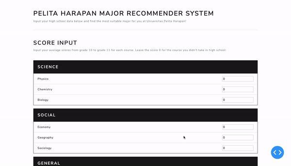
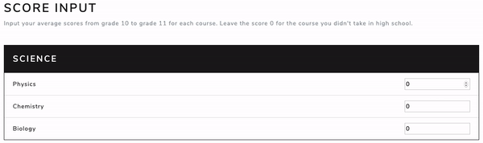
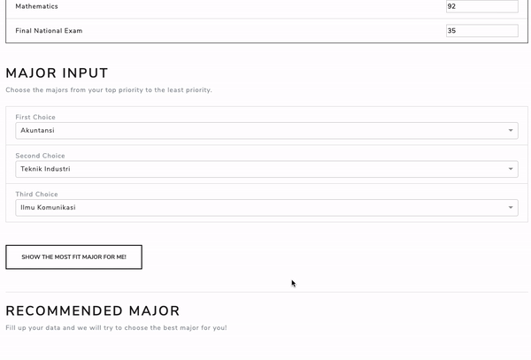
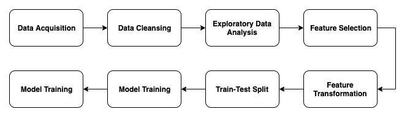

# Pelita Harapan Major Recommender System (PHMRS)

## Background

Many students of twelfth grade sometimes confused about what to choosing their major in university. 

<p>&nbsp;</p>

## Getting Started

### Prerequisites

Make sure you have the following prerequisites in order to run the application.

* [Python3](https://www.python.org/downloads/)
* [pip](https://pypi.org/project/pip/)
* [Jupyter Notebook](https://jupyter.org/)

### Running Instruction

Follow the instruction below step-by-step.

#### 1. Cloning/Downloading the Repository 

##### Option 1: Cloning

Run the following command to clone the repository:

```sh
$ git clone https://github.com/gerrychandra/educational_data_mining.git
```

##### Option 2: Downloading

* Go to https://github.com/gerrychandra/educational_data_mining
* Download the repository

#### 2. Installing the Requirements

Inside the `educational_data_mining` directory, run the following command:

```sh
$ pip install -r requirements.txt
```

#### 3. Running the Application

Run the following command to start the app:

```sh
$ python main.py 
```

You should see something like this in the terminal:

```sh
Running on http://127.0.0.1:8050/
Debugger PIN: XXX-XXX-XXX
 * Serving Flask app "main" (lazy loading)
 * Environment: production
   WARNING: This is a development server. Do not use it in a production deployment.
   Use a production WSGI server instead.
 * Debug mode: on
Running on http://127.0.0.1:8050/
Debugger PIN: XXX-XXX-XXX
```

When it appears, open your browser and go to `http://127.0.0.1:8050/` to access the app.

<p>&nbsp;</p>

## Layout and Usage

### Home Screen

The home screen will look like this:



<p>&nbsp;</p>

### Score Input

You can manually input scores by typing the number within the range of 0-100.



<p>&nbsp;</p>

### Major Input

Major options can be accessed through the dropdown list. You can either scroll or type to find the major.


<p>&nbsp;</p>

### Recommendation Result

After filling up all the necessary data, hit the button and you will see the most recommended major for you.



<p>&nbsp;</p>

## Development Flow


The diagram above shows major steps of this project development. Each block will be explained in the following subsections.

### Model Development



The whole process of model development can roughly be represented by the above diagram.
Final model used in this project is Random Forest Classifier. The raw code from data cleansing to model evaluation 
is available inside the [notebooks](notebooks) directory in this repository. If you want to understand more about the 
model development, you can check the documentation [here](docs/model_dev.md).

### Front-end Development

### Integration 

Model that's already fitted to the train data is then saved as pickle with `.pkl` extension. The pickled model can later
be loaded for further utilisation. [Model](model) directory contains all the three trained model with different algorithms and
one script `predictor.py`. The script contains a class called `Predictor` which will be called later to perform live 
prediction in the app using one of the three models. 

### Production

Once everything is done, the app is ready to use.

<p>&nbsp;</p>

## Suggestions


<p>&nbsp;</p>

## Authors

* Gerry Chandra
* Nadya Alimin
* Budi Khusnandar

<p>&nbsp;</p>

> Made as a Frontier Technology course project at Universitas Pelita Harapan.
